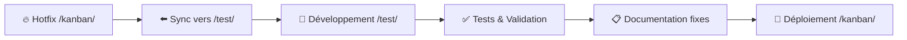

# 📁 Structure du Projet Kanban SSIR

## 🌍 Vue d'ensemble des environnements

Ce projet utilise **GitHub Pages** avec plusieurs dossiers représentant différents **environnements** pour simplifier le déploiement et les tests.

```
timox.github.io/
├── kanban/           # 🚀 PRODUCTION
├── test/             # 🧪 DÉVELOPPEMENT/TEST  
├── kanbantest/       # 🔬 EXPÉRIMENTATION
└── docs/             # 📚 DOCUMENTATION
```

---

## 🚀 `/kanban/` - ENVIRONNEMENT DE PRODUCTION

**URL d'accès :** `https://timox.github.io/kanban/`

### Description
Environnement de production stable utilisé par les équipes SSIR au quotidien.

### Structure
```
kanban/
├── index.html              # Point d'entrée principal
├── css/                    # Styles modulaires
│   ├── kanban-base.css     # Styles de base + flèches navigation
│   ├── kanban-modal.css    # Styles modales
│   └── kanban-responsive.css # Responsive design
├── js/                     # JavaScript modulaire
│   ├── kanban-app.js       # Application principale
│   ├── config/             # Configuration
│   │   ├── constants.js    # Constantes (statuts, bureaux...)
│   │   └── strategyData.js # Données stratégiques
│   ├── managers/           # Gestionnaires métier
│   │   ├── FilterManager.js     # Filtres et recherche
│   │   ├── ViewManager.js       # Modes de vue + rendu centralisé
│   │   ├── ModalManager.js      # Gestion modales
│   │   ├── HistoryManager.js    # Historique et timeline
│   │   ├── DatePickerManager.js # Sélecteur de dates
│   │   └── GristManager.js      # Interface Grist
│   ├── renderers/          # Moteurs de rendu (legacy prod)
│   │   └── boardRenderer.js     # Rendu des colonnes kanban (fusionné dans ViewManager côté test)
│   └── utils/              # Utilitaires
│       ├── LoggerManager.js     # Système de logs
│       ├── UserActionManager.js # Actions utilisateur
│       ├── NotesJsonMigrator.js # Migration notes JSON
│       ├── badges.js           # Génération badges
│       ├── dates.js            # Gestion dates
│       └── dom.js              # Manipulation DOM
└── CLAUDE.md               # Mémoire Claude (historique)
```

### Caractéristiques actuelles
- ✅ Flèches navigation latérales
- ✅ Mode focus simplifié (filtre statut uniquement)  
- ✅ Comptages badges corrects
- ✅ Colonnes vides masquées en mode compact
- ✅ Système de coloration des colonnes par statut
- ✅ Architecture modulaire complète

### 🔧 Améliorations Architecturales Récentes (2025-07-27)
- ✅ **Gestion événements anti-duplication** - Protection contre les écouteurs multiples
- ✅ **Protection anti-spam** - Mécanismes timeout pour interactions rapides
- ✅ **Z-index coordination** - Gestion hiérarchie modales et overlays
- ✅ **Format Grist unifié** - Support arrays `["L", number]` et types flexibles
- ✅ **Widget overlay fixes** - Résolution conflits superposition interface
- ✅ **Tracking historique statut** - Correction bugs drag&drop et modal (27/07/2025)
- ✅ **Synchronisation environnements** - Code /kanban/ → /test/ pour développement
- ✅ **Tests automatisés** - Suite de tests API Grist pour analyse données

---

## 🧪 `/test/` - ENVIRONNEMENT DE DÉVELOPPEMENT **[ACTUEL]**

**URL d'accès :** `https://timox.github.io/test/`

### Description
🔥 **Environnement de développement principal** - Synchronisé avec production et contient les dernières corrections critiques.

### Structure
```
test/
├── index.html              # Version de test
├── css/                    # CSS synchronisé avec production
├── js/
│   ├── app-initializer.js  # ✅ Point d'entrée ES module (instancie core/KanbanManager)
│   ├── core/
│   │   └── KanbanManager.js # ♻️ Orchestrateur principal aligné avec la prod
│   ├── managers/
│   │   ├── ModalManager.js # ✅ Fix tracking statut via modal avec UserActionManager
│   │   ├── JalonManager.js # ✅ Dernières corrections édition/suppression jalons
│   │   └── ...             # Autres managers synchronisés
│   ├── utils/
│   │   ├── UserActionManager.js    # ✅ Système tracking actions utilisateur
│   │   ├── NotesJsonMigrator.js    # ✅ Migration notes vers JSON
│   │   └── ...                     # Autres utilitaires
│   └── kanban-app.js       # 💤 Version legacy conservée pour référence (non chargée)
├── 🔒 [IGNORÉ] Scripts avec identifiants # Scripts tests/API (exclus du git)
├── ARCHITECTURE.md         # Documentation architecture complète
├── ROADMAP.md              # Suivi des chantiers à venir
├── REFACTORING_ARCHITECTURE.md # Centralisation des responsabilités de rendu
└── schema.md               # Schéma base de données Grist
```

### 🎯 Usage Actuel
- **🔥 Environnement principal** pour développement et corrections
- **✅ Initialisation unique** : seul `core/KanbanManager` est instancié (kanban-app.js legacy désactivé)
- **✅ Tests automatisés** via scripts API Grist (readonly-test-suite.js)
- **🔧 Corrections critiques** tracking historique des changements de statut
- **📊 Analyse données** (67 tâches, 2 jalons, 0 changements statut trackés)
- **🛡️ Sécurité** - Scripts avec identifiants exclus du repository git

### 2025-09 – Mise à jour ergonomie /test/
- **Repliage colorimétrique** : les boutons de collapse reprennent la couleur de colonne et mettent à jour le compteur de pile
  pour clarifier les colonnes masquées.
- **Pile détaillée persistante** : le mode détaillé restaure automatiquement la pile latérale après chaque rafraîchissement et
  conserve les colonnes repliées lors des changements de vue.
- **Modal tâche repensée** : formulaire deux colonnes, panneau historique latéral repliable et chargement différé des
  commentaires.
- **Normalisation options Grist** : listes Bureau / Responsable / Projet alimentées par `KanbanManager.normalizeGristOptions()`
  (suppression du préfixe `L`, tri cohérent).
- **Aide contextuelle à la demande** : la fenêtre des raccourcis clavier s'ouvre via le bouton `?` au lieu d'apparaître au
  chargement.
- **Mode détaillé rétabli par défaut** : `ViewManager` réapplique le mode détaillé dès l'initialisation et synchronise le
  `KanbanManager`, ce qui redonne accès immédiat aux boutons de repliage et à la pile latérale.
- **Largeur de colonnes alignée** : le gabarit détaillé passe à 360 px (focus 620 px) pour rétablir une lecture pleine largeur
  équivalente aux vues statistiques.
- **Pile focus verticalisée** : en mode focus les colonnes repliées s'empilent désormais dans un seul panneau vertical au-dessus
  de la colonne active au lieu de rester sur la même ligne.
- **Pile latérale ancrée** : `ViewManager` installe la pile des colonnes repliées dans `.kanban-wrapper` et bascule la
  grille sur deux colonnes (ou une seule en focus/responsive) pour que les colonnes réduites restent visibles et cliquables.
- **Stratégies Grist réactives** : la modal rafraîchit l'accordéon dès que les données `Ssir_strategie2` sont chargées et évite
  d'afficher la bannière « Cause probable » lorsque la table répond.
- **Stats embarquées** : la page `stats.html` expose un conteneur `#stats-container` et attend explicitement `grist.ready({
  requiredAccess: 'read table' })` pour lever l'erreur d'initialisation.
- **Gabarit Grist aligné** : `test/index.html` est encapsulé dans `view_data_pane_container flexvbox viewsection_type_custom`
  pour occuper toute la largeur disponible comme la vue statistiques, tout en conservant les modales globales.
- **Boutons de repliage minimalistes** : `kanban-base.css` supprime les fonds dégradés, garde les icônes `arrow-bar` et
  applique directement la couleur de statut sur les contrôles de repliage et de pile.
- **Filtres synchronisés** : `GristManager.loadGristOptions()` fusionne les valeurs Grist avec les listes par défaut (bureau,
  responsable, projet, urgence, impact, statut) avant normalisation, éliminant l'option fantôme « L » et les sélecteurs vides.
- **Stats consolidées** : `stats-app.js` restaure la table Priorité/Statut et nettoie les marqueurs de conflit qui provoquaient
  le `SyntaxError: expected property name, got '<<'`.

### Synchronisation
- **kanban/ → test/** (27/07/2025) : Synchronisation complète pour développement
- **test/ → kanban/** : Déploiement après validation corrections

---

## 🔬 `/kanbantest/` - ENVIRONNEMENT D'EXPÉRIMENTATION

**URL d'accès :** `https://timox.github.io/kanbantest/`

### Description
Environnement minimal et autonome pour expérimentations rapides et prototypes.

### Structure
```
kanbantest/
├── index.html              # Interface simplifiée
└── js.js                   # JavaScript monolithique
```

### Caractéristiques
- **Structure simplifiée** (2 fichiers seulement)
- **Indépendant** des autres environnements
- **Prototypage rapide** sans impact sur la production
- **Tests d'interface** et d'ergonomie

---

## 📚 `/docs/` - DOCUMENTATION

### Description
Documentation technique, guides utilisateur et spécifications.

### Contenu typique
- Guides d'utilisation
- Documentation API
- Spécifications techniques
- Tutoriels de développement

---

## 🔄 Workflow de développement

### 🎯 **Workflow Actuel (2025-07-27)**



### 1. **Développement Principal** (`/test/`) **[ACTUEL]**
```bash
# ✅ Corrections critiques tracking historique
# 🧪 Tests automatisés API Grist  
# 📊 Analyse données (67 tâches, 2 jalons)
# 🛡️ Scripts sécurisés (identifiants exclus git)
```

### 2. **Production** (`/kanban/`)
```bash
# ✅ Corrections déployées (handleDragEnd + ModalManager)
# 🚀 Utilisation quotidienne équipes SSIR  
# 📈 Tracking statut fonctionnel après corrections
```

### 3. **Expérimentation** (`/kanbantest/`)
```bash
# 🔬 Prototypes rapides si nécessaire
# 💡 Tests concepts avant implémentation
```

### 4. **Synchronisation**
```bash
# ✅ FAIT: kanban/ → test/ (27/07/2025)
# ✅ FAIT: corrections appliquées test/ → kanban/  
# 🔄 CONTINU: développement principalement en test/
```

---

## 🎯 Avantages de cette structure

### **Simplicité GitHub Pages**
- **URL directe** par dossier : `timox.github.io/dossier/`
- **Déploiement automatique** à chaque commit
- **Pas de build** ou configuration complexe

### **Isolation des environnements**
- **Production stable** non impactée par les tests
- **Développement libre** en parallèle
- **Expérimentation** sans risques

### **Flexibilité de déploiement**
- **Hotfix production** : modification directe `/kanban/`
- **Feature complète** : développement `/test/` puis copie
- **Prototype rapide** : test concept `/kanbantest/`

### **Maintenance facilitée**
- **Structure claire** et prévisible
- **Documentation centralisée** dans chaque environnement
- **Historique Git** par environnement

---

## 📋 Bonnes pratiques

### **Développement** (Workflow actuel 2025-07-27)
1. 🔧 **Développer dans `/test/`** (environnement principal)
2. 🧪 **Tester avec scripts automatisés** (readonly-test-suite.js)
3. ✅ **Valider corrections** (tracking historique, jalons...)
4. 📋 **Documenter fixes** (fix-status-tracking.md)
5. 🚀 **Déployer vers `/kanban/`** après validation

### **Hotfix production** 
1. 🔥 Correction urgente dans `/kanban/`
2. 📋 Commit avec tag `[HOTFIX]`  
3. ⬅️ **Synchroniser vers `/test/`** immédiatement
4. 📝 Documenter dans CHANGELOG

### **Sécurité** (Nouveau 2025-07-27)
1. 🛡️ **Scripts tests** avec identifiants dans `/test/` (exclus git)
2. 🔒 **Gitignore** protège contre commits accidentels
3. 🧹 **Historique git nettoyé** de tous identifiants sensibles
4. 📊 **Tests API** en lecture seule pour analyse données

---

*Dernière mise à jour : 2025-07-27*  
*Structure mise à jour - Workflow principal en `/test/` avec corrections tracking historique*