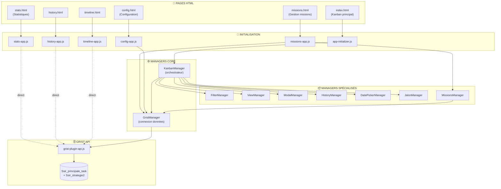
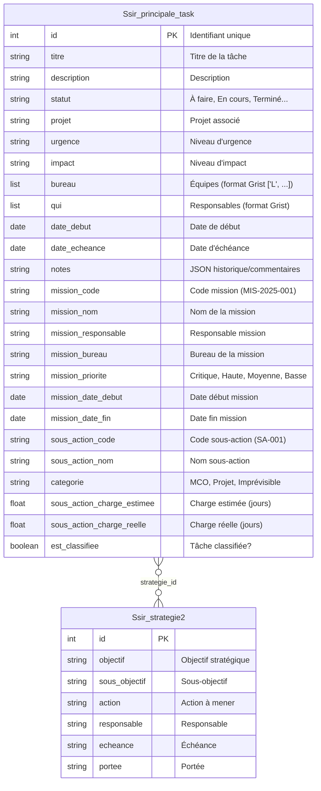
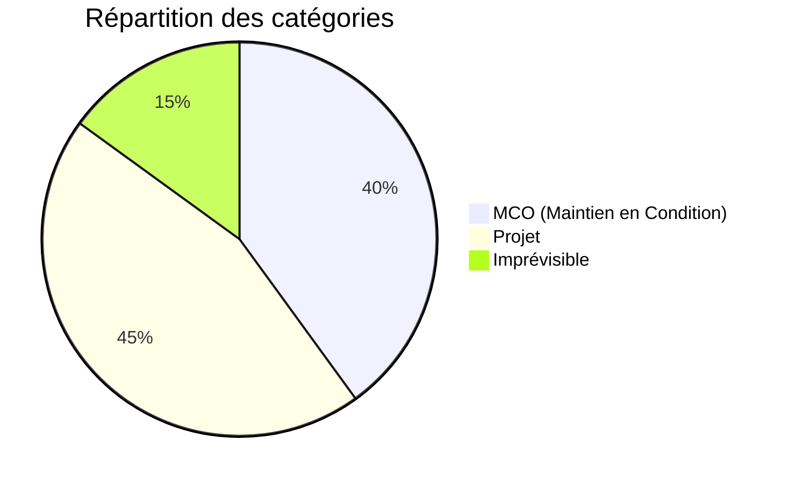
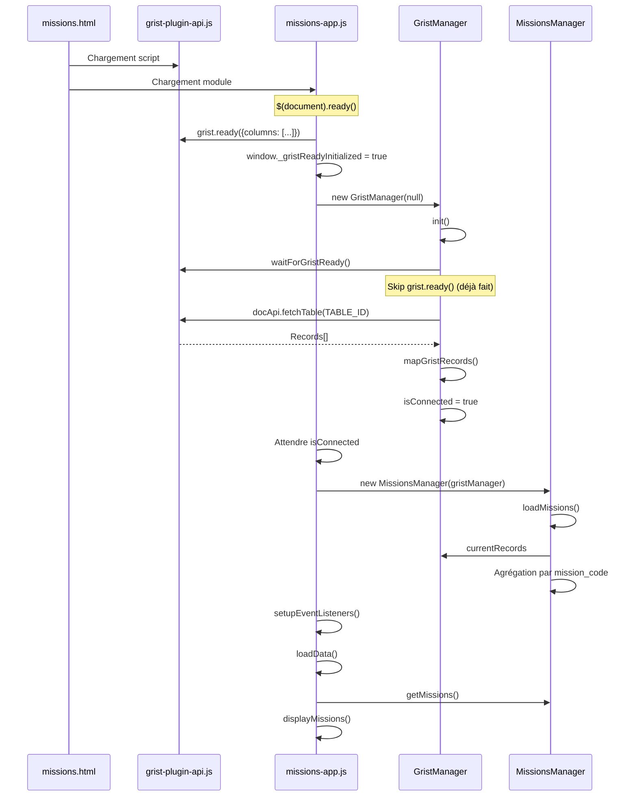
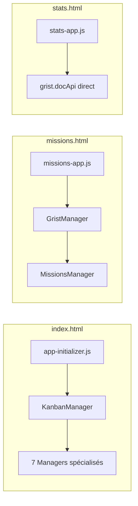
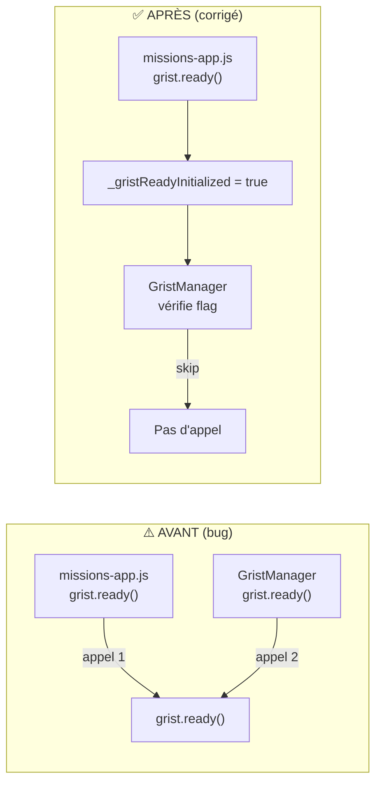
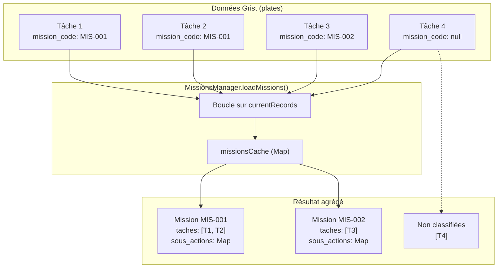
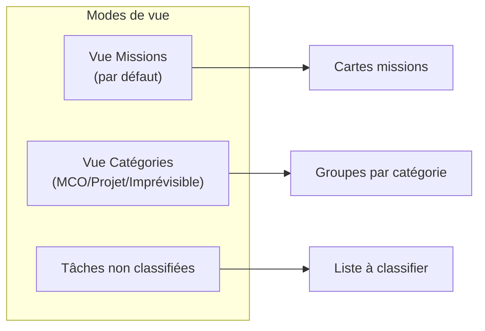

# Architecture du Système de Missions

> **Version**: 1.0 - Décembre 2025
> **Status**: En développement

---

## Vue d'ensemble

Le système de missions permet de classifier et organiser les tâches selon une hiérarchie:

```
Stratégie → Mission → Sous-action → Tâche
```

### Approche technique: **Dénormalisation**

Plutôt que de créer des tables séparées pour les missions, les données sont stockées directement dans chaque tâche (table `Ssir_principale_task`). Le `MissionsManager` agrège ces données pour reconstruire la structure hiérarchique.

---

## Schéma d'architecture globale



---

## Modèle de données

### Structure dénormalisée (table unique enrichie)



### Colonnes ajoutées pour les missions (13 nouvelles)

| Colonne | Type | Description |
|---------|------|-------------|
| `mission_code` | Text | Code unique (ex: MIS-2025-001) |
| `mission_nom` | Text | Nom descriptif |
| `mission_responsable` | Text | Responsable de la mission |
| `mission_bureau` | Text | Bureau/équipe |
| `mission_priorite` | Choice | Critique, Haute, Moyenne, Basse |
| `mission_date_debut` | Date | Date de début |
| `mission_date_fin` | Date | Date de fin |
| `sous_action_code` | Text | Code sous-action (ex: SA-001) |
| `sous_action_nom` | Text | Nom de la sous-action |
| `categorie` | Choice | MCO, Projet, Imprévisible |
| `sous_action_charge_estimee` | Numeric | Charge estimée (jours) |
| `sous_action_charge_reelle` | Numeric | Charge réelle (jours) |
| `est_classifiee` | Bool | Tâche rattachée à une mission? |

---

## Catégories de sous-actions



| Catégorie | Description | Exemples |
|-----------|-------------|----------|
| **MCO** 🔧 | Maintien en Condition Opérationnelle | Mises à jour, patches, monitoring |
| **Projet** 🎯 | Projets planifiés | Nouvelles fonctionnalités, migrations |
| **Imprévisible** ⚡ | Incidents et urgences | Bugs critiques, pannes |

---

## Flux d'initialisation

### Page missions.html



### Comparaison des patterns d'initialisation



---

## Protection contre les appels multiples à grist.ready()

### Problème identifié



### Solution implémentée

```javascript
// missions-app.js
if (typeof grist !== 'undefined' && !window._gristReadyInitialized) {
  grist.ready({ requiredAccess: 'full', columns: [...] });
  window._gristReadyInitialized = true;  // Flag anti-duplication
}

// GristManager.js
if (!window._gristReadyInitialized) {
  gristApi.ready({ requiredAccess: 'full' });
  // ... callbacks
  window._gristReadyInitialized = true;
}
```

---

## MissionsManager: Agrégation des données

### Principe d'agrégation



### Structure d'une mission agrégée

```javascript
{
  code: "MIS-2025-001",
  nom: "Migration Cloud Azure",
  responsable: "Jean Dupont",
  bureau: "Infrastructure",
  priorite: "Haute",
  date_debut: "2025-01-15",
  date_fin: "2025-06-30",

  // Map des sous-actions
  sous_actions: Map {
    "SA-001" => {
      code: "SA-001",
      nom: "Audit infrastructure",
      categorie: "Projet",
      charge_estimee: 5,
      charge_reelle: 0,
      taches: [/* tâches liées */]
    },
    "SA-002" => { ... }
  },

  // Toutes les tâches de la mission
  taches: [/* Array de tâches */],

  // Statistiques calculées
  stats: {
    total: 15,
    completed: 5,
    inProgress: 8
  }
}
```

---

## Interface utilisateur (missions.html)

### Vues disponibles



### Fonctionnalités

| Fonction | Description |
|----------|-------------|
| Création mission | Modal avec code auto-généré (MIS-YYYY-XXX) |
| Sous-actions | Ajout lors de la création de mission |
| Filtres | Priorité, catégorie, recherche textuelle |
| Export | JSON avec structure complète |
| Statistiques | Missions actives, tâches, retards |

---

## Fichiers clés

| Fichier | Rôle | Lignes |
|---------|------|--------|
| `missions.html` | Page de gestion des missions | ~440 |
| `js/missions-app.js` | Application principale missions | ~590 |
| `js/managers/MissionsManager.js` | Logique métier missions | ~440 |
| `js/managers/GristManager.js` | Connexion Grist | ~900 |

---

## Points de vigilance

### 1. Scripts requis dans missions.html

```html
<!-- OBLIGATOIRE: Grist API en premier -->
<script src="https://docs.getgrist.com/grist-plugin-api.js"></script>

<!-- Puis jQuery et Bootstrap -->
<script src="https://code.jquery.com/jquery-3.6.0.min.js"></script>
<script src="https://cdn.jsdelivr.net/npm/bootstrap@5.3.3/dist/js/bootstrap.bundle.min.js"></script>

<!-- Enfin l'application -->
<script type="module" src="js/missions-app.js"></script>
```

### 2. Flag anti-duplication grist.ready()

Le flag `window._gristReadyInitialized` empêche les appels multiples à `grist.ready()` qui peuvent causer des erreurs.

### 3. Callbacks Grist

⚠️ **Problème potentiel**: Les callbacks `onRecords` et `onOptions` dans `GristManager.waitForGristReady()` sont à l'intérieur du bloc `if (!window._gristReadyInitialized)`. Si missions-app.js définit le flag en premier, ces callbacks ne seront pas enregistrés.

**Solution recommandée**: Sortir l'enregistrement des callbacks du bloc conditionnel.

---

## Évolutions futures

- [ ] Rattachement de tâches existantes à une mission
- [ ] Édition des missions existantes
- [ ] Dashboard avec graphiques de progression
- [ ] Export vers formats multiples (CSV, Excel)
- [ ] Synchronisation temps réel entre pages

---

*Documentation générée le 2025-12-16*
