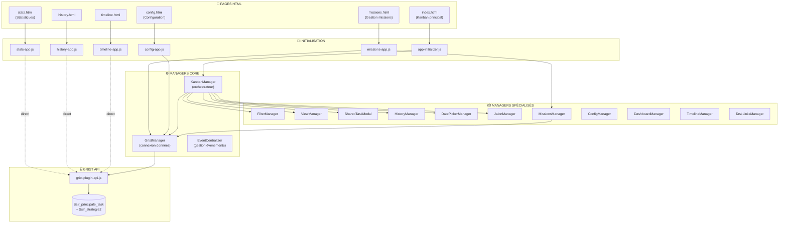
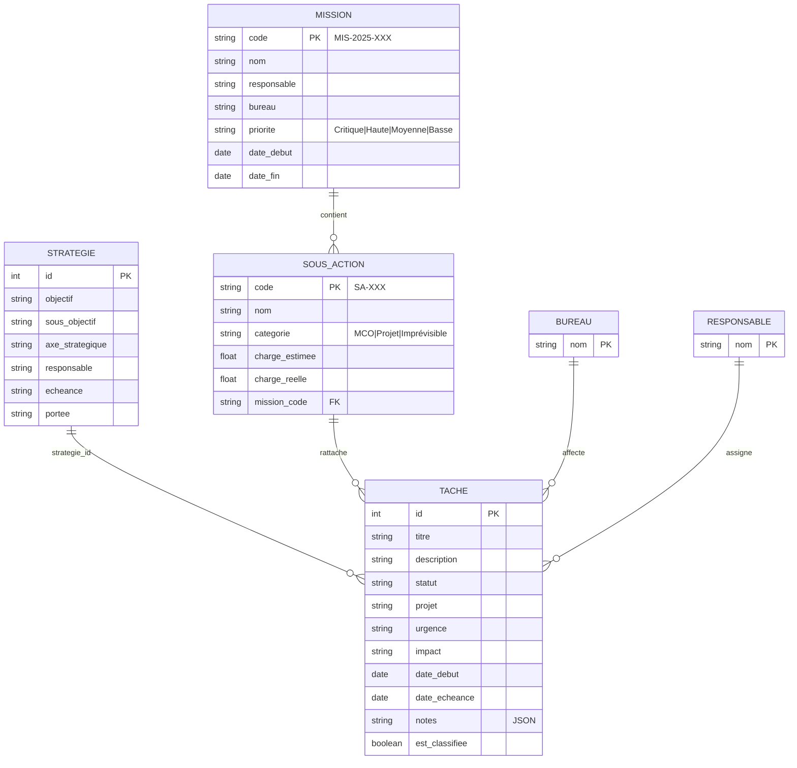
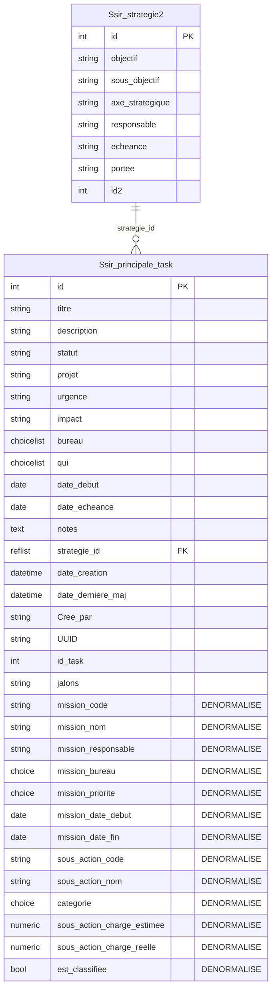
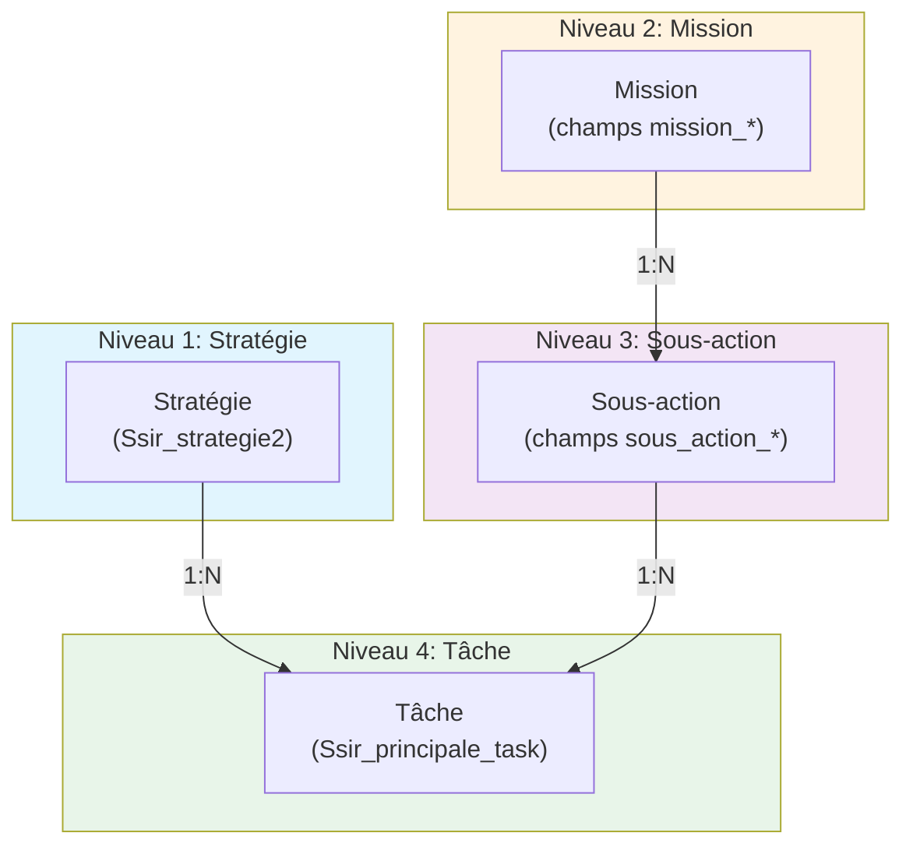
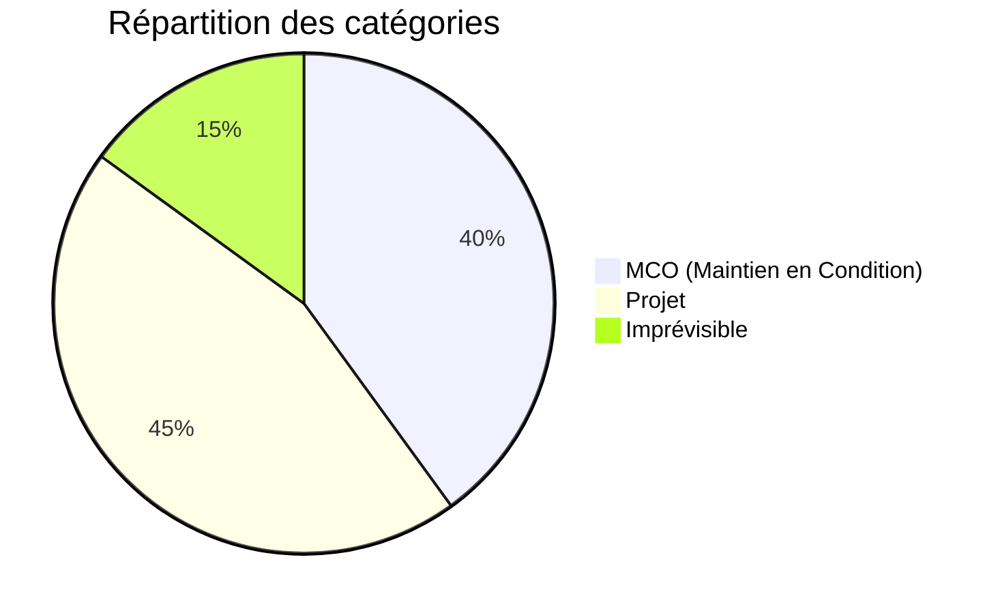
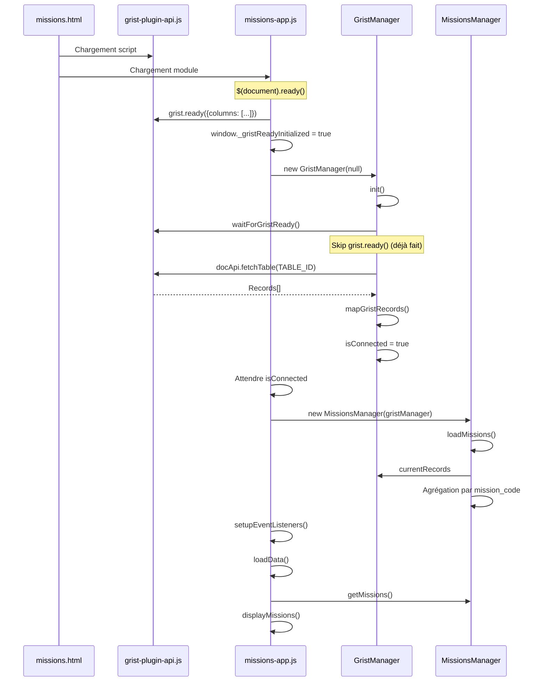
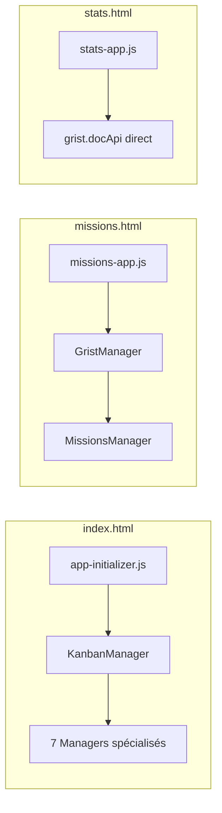
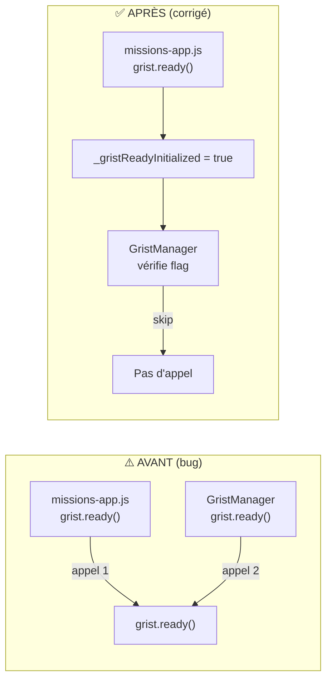
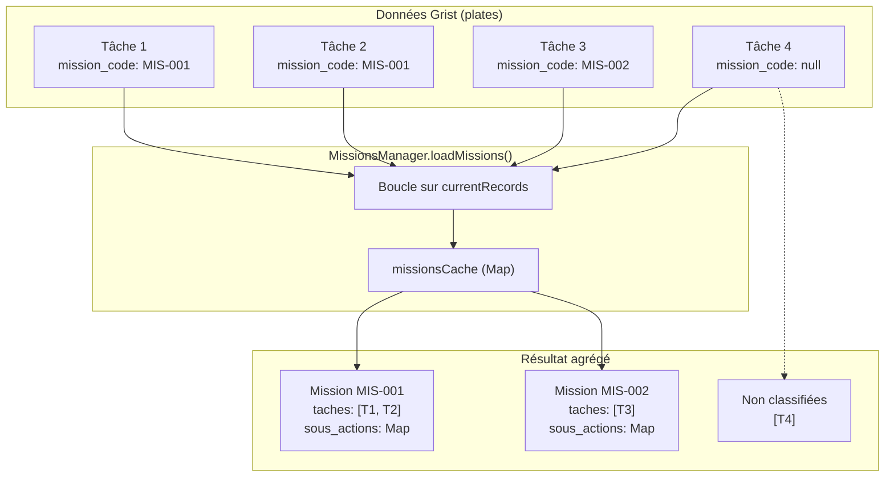
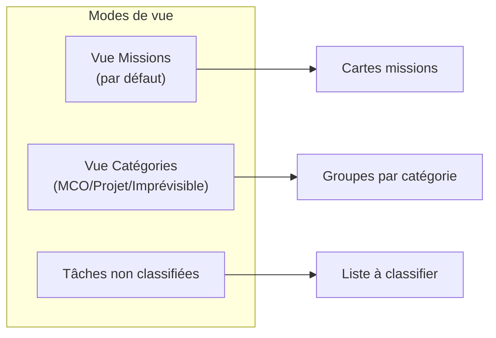

# Architecture du Système de Missions

> **Version**: 1.1 - Février 2026
> **Status**: En développement

---

## Vue d'ensemble

Le système de missions permet de classifier et organiser les tâches selon une hiérarchie:

```
Stratégie → Mission → Sous-action → Tâche
```

### Approche technique: **Dénormalisation**

Plutôt que de créer des tables séparées pour les missions, les données sont stockées directement dans chaque tâche (table `Ssir_principale_task`). Le `MissionsManager` agrège ces données pour reconstruire la structure hiérarchique.

---

## Schéma d'architecture globale



---

## Modèle Conceptuel de Données (MCD)

### Vue d'ensemble des entités



### MCD Logique - Implémentation dénormalisée

> **Note**: En pratique, les entités MISSION et SOUS_ACTION ne sont pas des tables séparées.
> Elles sont **dénormalisées** dans la table TACHE pour simplifier l'architecture Grist.



### Hiérarchie conceptuelle



### Cardinalités

| Relation | Cardinalité | Description |
|----------|-------------|-------------|
| Stratégie → Tâche | 1:N | Une stratégie peut avoir plusieurs tâches |
| Mission → Sous-action | 1:N | Une mission contient plusieurs sous-actions |
| Sous-action → Tâche | 1:N | Une sous-action regroupe plusieurs tâches |
| Bureau → Tâche | N:M | Un bureau gère plusieurs tâches, une tâche peut être multi-bureaux |
| Responsable → Tâche | N:M | Même logique pour les responsables |

### Dictionnaire des données

#### Table `Ssir_principale_task` (principale)

| Colonne | Type Grist | Obligatoire | Description |
|---------|------------|-------------|-------------|
| `id` | Int (auto) | ✅ | Identifiant unique |
| `titre` | Text | ✅ | Titre de la tâche |
| `description` | Text | ❌ | Description détaillée |
| `statut` | Choice | ✅ | Backlog, À faire, En cours, etc. |
| `bureau` | ChoiceList | ❌ | Liste des bureaux (format ['L', ...]) |
| `qui` | ChoiceList | ❌ | Liste des responsables |
| `urgence` | Choice | ❌ | Faible, Moyenne, Élevée, Critique |
| `impact` | Choice | ❌ | Mineur, Modéré, Majeur, Critique |
| `projet` | Choice | ❌ | Projet associé |
| `date_debut` | Date | ❌ | Date de début prévue |
| `date_echeance` | Date | ❌ | Date d'échéance |
| `strategie_id` | RefList | ❌ | Référence vers Ssir_strategie2 |
| `notes` | Text | ❌ | JSON contenant historique/commentaires |
| `mission_code` | Text | ❌ | Code mission (MIS-YYYY-XXX) |
| `mission_nom` | Text | ❌ | Nom de la mission |
| `mission_responsable` | Text | ❌ | Responsable mission |
| `mission_bureau` | Choice | ❌ | Bureau de la mission |
| `mission_priorite` | Choice | ❌ | Critique, Haute, Moyenne, Basse |
| `mission_date_debut` | Date | ❌ | Début de la mission |
| `mission_date_fin` | Date | ❌ | Fin prévue de la mission |
| `sous_action_code` | Text | ❌ | Code sous-action (SA-XXX) |
| `sous_action_nom` | Text | ❌ | Nom de la sous-action |
| `categorie` | Choice | ❌ | MCO, Projet, Imprévisible |
| `sous_action_charge_estimee` | Numeric | ❌ | Charge estimée (jours) |
| `sous_action_charge_reelle` | Numeric | ❌ | Charge réalisée (jours) |
| `est_classifiee` | Bool | ❌ | True si rattachée à une mission |

#### Table `Ssir_strategie2` (référence)

| Colonne | Type Grist | Description |
|---------|------------|-------------|
| `id` | Int (auto) | Identifiant unique |
| `objectif` | Text | Objectif stratégique |
| `sous_objectif` | Text | Sous-objectif |
| `axe_strategique` | Text | Axe stratégique / Action à mener |
| `responsable` | Text | Responsable de l'action |
| `echeance` | Text | Échéance prévue |
| `portee` | Text | Portée de l'action |

### Colonnes ajoutées pour les missions (13 nouvelles)

| Colonne | Type | Description |
|---------|------|-------------|
| `mission_code` | Text | Code unique (ex: MIS-2025-001) |
| `mission_nom` | Text | Nom descriptif |
| `mission_responsable` | Text | Responsable de la mission |
| `mission_bureau` | Text | Bureau/équipe |
| `mission_priorite` | Choice | Critique, Haute, Moyenne, Basse |
| `mission_date_debut` | Date | Date de début |
| `mission_date_fin` | Date | Date de fin |
| `sous_action_code` | Text | Code sous-action (ex: SA-001) |
| `sous_action_nom` | Text | Nom de la sous-action |
| `categorie` | Choice | MCO, Projet, Imprévisible |
| `sous_action_charge_estimee` | Numeric | Charge estimée (jours) |
| `sous_action_charge_reelle` | Numeric | Charge réelle (jours) |
| `est_classifiee` | Bool | Tâche rattachée à une mission? |

---

## Catégories de sous-actions



| Catégorie | Description | Exemples |
|-----------|-------------|----------|
| **MCO** 🔧 | Maintien en Condition Opérationnelle | Mises à jour, patches, monitoring |
| **Projet** 🎯 | Projets planifiés | Nouvelles fonctionnalités, migrations |
| **Imprévisible** ⚡ | Incidents et urgences | Bugs critiques, pannes |

---

## Flux d'initialisation

### Page missions.html



### Comparaison des patterns d'initialisation



---

## Protection contre les appels multiples à grist.ready()

### Problème identifié



### Solution implémentée

```javascript
// missions-app.js
if (typeof grist !== 'undefined' && !window._gristReadyInitialized) {
  grist.ready({ requiredAccess: 'full', columns: [...] });
  window._gristReadyInitialized = true;  // Flag anti-duplication
}

// GristManager.js
if (!window._gristReadyInitialized) {
  gristApi.ready({ requiredAccess: 'full' });
  // ... callbacks
  window._gristReadyInitialized = true;
}
```

---

## MissionsManager: Agrégation des données

### Principe d'agrégation



### Structure d'une mission agrégée

```javascript
{
  code: "MIS-2025-001",
  nom: "Migration Cloud Azure",
  responsable: "Jean Dupont",
  bureau: "Infrastructure",
  priorite: "Haute",
  date_debut: "2025-01-15",
  date_fin: "2025-06-30",

  // Map des sous-actions
  sous_actions: Map {
    "SA-001" => {
      code: "SA-001",
      nom: "Audit infrastructure",
      categorie: "Projet",
      charge_estimee: 5,
      charge_reelle: 0,
      taches: [/* tâches liées */]
    },
    "SA-002" => { ... }
  },

  // Toutes les tâches de la mission
  taches: [/* Array de tâches */],

  // Statistiques calculées
  stats: {
    total: 15,
    completed: 5,
    inProgress: 8
  }
}
```

---

## Interface utilisateur (missions.html)

### Vues disponibles



### Fonctionnalités

| Fonction | Description |
|----------|-------------|
| Création mission | Modal avec code auto-généré (MIS-YYYY-XXX) |
| Sous-actions | Ajout lors de la création de mission |
| Filtres | Priorité, catégorie, recherche textuelle |
| Export | JSON avec structure complète |
| Statistiques | Missions actives, tâches, retards |

---

## Fichiers clés

| Fichier | Rôle | Lignes |
|---------|------|--------|
| `missions.html` | Page de gestion des missions | ~440 |
| `js/missions-app.js` | Application principale missions | ~590 |
| `js/managers/MissionsManager.js` | Logique métier missions | ~440 |
| `js/managers/GristManager.js` | Connexion Grist | ~900 |

---

## Points de vigilance

### 1. Scripts requis dans missions.html

```html
<!-- OBLIGATOIRE: Grist API en premier -->
<script src="https://docs.getgrist.com/grist-plugin-api.js"></script>

<!-- Puis jQuery et Bootstrap -->
<script src="https://code.jquery.com/jquery-3.6.0.min.js"></script>
<script src="https://cdn.jsdelivr.net/npm/bootstrap@5.3.3/dist/js/bootstrap.bundle.min.js"></script>

<!-- Enfin l'application -->
<script type="module" src="js/missions-app.js"></script>
```

### 2. Flag anti-duplication grist.ready()

Le flag `window._gristReadyInitialized` empêche les appels multiples à `grist.ready()` qui peuvent causer des erreurs.

### 3. Callbacks Grist

✅ **Corrigé**: Deux flags séparés sont utilisés:
- `window._gristReadyInitialized` : pour `grist.ready()`
- `window._gristCallbacksInitialized` : pour `onRecords` / `onOptions`

---

## Configuration dans Grist

### Étape 1: Créer les colonnes

Dans la table `Ssir_principale_task`, ajouter les colonnes suivantes:

#### Colonnes Mission (7)

| Colonne | Type | Options |
|---------|------|---------|
| `mission_code` | Text | - |
| `mission_nom` | Text | - |
| `mission_responsable` | Text | - |
| `mission_bureau` | Choice | Infrastructure, Sécurité, Support, Développement |
| `mission_priorite` | Choice | Critique, Haute, Moyenne, Basse |
| `mission_date_debut` | Date | - |
| `mission_date_fin` | Date | - |

#### Colonnes Sous-action (5)

| Colonne | Type | Options |
|---------|------|---------|
| `sous_action_code` | Text | - |
| `sous_action_nom` | Text | - |
| `categorie` | Choice | MCO, Projet, Imprévisible |
| `sous_action_charge_estimee` | Numeric | - |
| `sous_action_charge_reelle` | Numeric | - |

#### Colonne Meta (1)

| Colonne | Type | Description |
|---------|------|-------------|
| `est_classifiee` | Toggle (Bool) | Coché si tâche rattachée à une mission |

### Étape 2: Ajouter le widget missions.html

1. **Ajouter une page** dans votre document Grist
2. **Ajouter une section** → Type: "Custom"
3. **URL du widget**:
   ```
   https://timox.github.io/kanbantest/missions.html
   ```
4. **Accès**: Sélectionner "Full document access"
5. **Table source**: `Ssir_principale_task`

### Étape 3: Configuration des Choice

Pour les colonnes Choice, configurer les options:

```
mission_priorite:
  - Critique
  - Haute
  - Moyenne
  - Basse

mission_bureau:
  - Infrastructure
  - Sécurité
  - Support
  - Développement
  (ajouter vos bureaux)

categorie:
  - MCO
  - Projet
  - Imprévisible
```

---

## Guide d'utilisation

### Créer une mission

1. Cliquer sur **"Nouvelle Mission"**
2. Remplir le formulaire:
   - **Code**: Auto-généré (MIS-YYYY-XXX)
   - **Nom**: Nom descriptif
   - **Responsable**: Personne en charge
   - **Bureau**: Équipe responsable
   - **Priorité**: Critique > Haute > Moyenne > Basse
   - **Dates**: Début et fin prévues
3. Optionnel: Ajouter des **sous-actions** initiales
4. Cliquer **"Enregistrer"**

### Modes de vue

| Mode | Description |
|------|-------------|
| **Vue Missions** | Cartes par mission avec sous-actions |
| **Vue Catégories** | Groupées par MCO/Projet/Imprévisible |
| **Non classifiées** | Tâches sans mission (à classifier) |

### Statistiques affichées

- **Missions actives**: Nombre de missions en cours
- **Tâches total**: Nombre de tâches dans toutes les missions
- **Non classifiées**: Tâches orphelines à rattacher
- **En retard**: Missions dépassant la date de fin

---

## Évolutions futures

- [x] Rattachement de tâches existantes à une mission (janvier 2026)
- [ ] Édition des missions existantes
- [ ] Dashboard avec graphiques de progression
- [ ] Export vers formats multiples (CSV, Excel)
- [ ] Synchronisation temps réel entre pages

---

*Documentation mise à jour le 2026-02-02*
